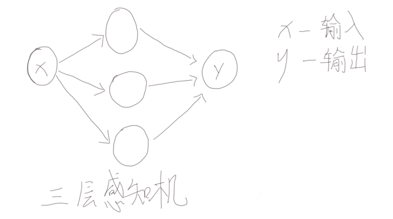
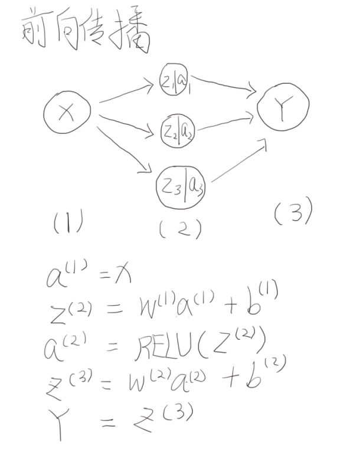
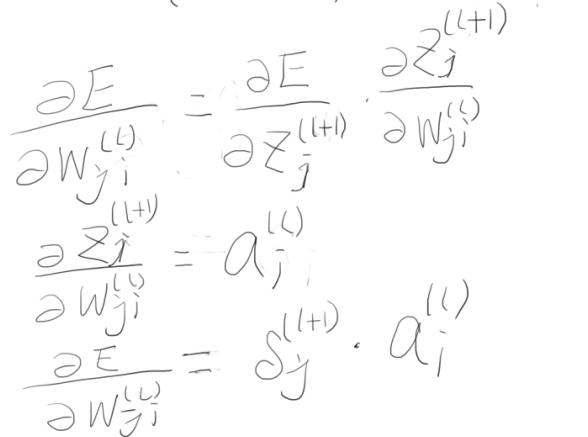
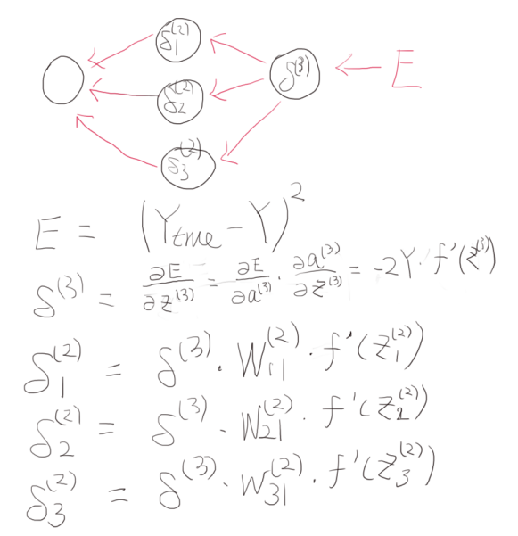
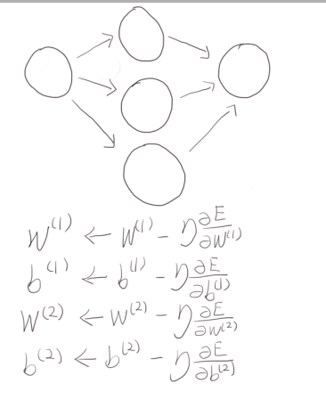
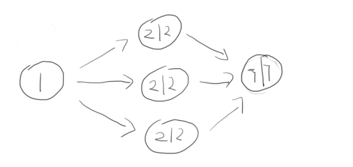
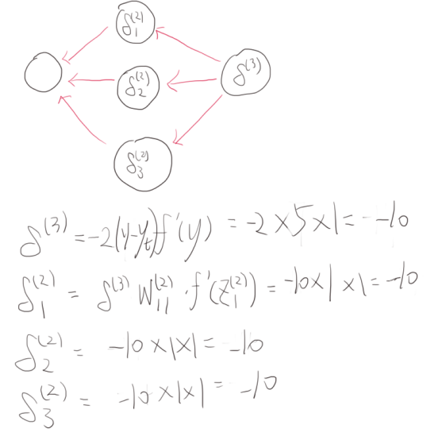
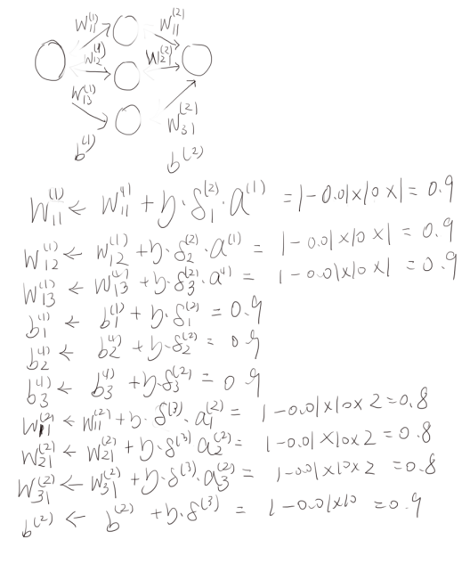
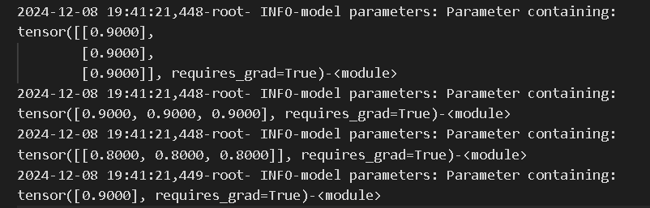

# 反向传播算法

假如有一个一隐层的神经网络，输入是一维度，隐层有3个神经元，输出是一维度。利用pytorch实现这个神经网络模型。假设神经网络的类是SimpleNN，根据类初始化一个实例model。打印model.parameters，一共有四个params，张量的维度分别是（3,1），（3），（1,3），（1）。由于这个网络涉及到两个线性层，而线性层从输入x映射到输出y的过程为$y=wx+b$。因此上述四个张量分别对应$w_1$、$b_1$、$w_2$、$b_2$。

在一个简单二分类任务中，假设损失函数为均方差$E=\frac{1}{2} (output-target)^2$，output是模型输出的结果，target是标记的结果。如果按照nn.MSEloss()计算，那么没有1/2，结果会有差距。按照神经网络的训练过程，基本为神经网络前向传播，计算误差和反向传播三个步骤。神经网络前向传播的过程把输入映射成输出。神经网络采用RELU激活函数。max(0,x)。

在前向传播过程中，每个神经元产生两个结果，通过输入求和运算得到z，z经过激活函数得到a。$z^{(l)}=\sum w^{(l-1)}a^{(l-1)}+b^{l}$，式子中的z、w、a、b都是向量。$a^{(l)}=f(z^{(l)})$。上标l表示神经网络的第l层。

如图所示，是前向传播的过程。图中的上标表示神经网络层数，下标表示向量中的位置。从图中可以看出，前向传播时，数据传递的方向$x \rightarrow z \rightarrow a \rightarrow y$，其中z和a是三维度的向量，而x和y是标量。

下文重点讲计算误差和反向传播步骤。得到输出Y之后，根据选定的误差函数，计算出神经网络预测值与实际值的差距，作为损失loss。误差计算的结果是给神经网络中的每一个节点都赋予一个误差值，且由后往前传播。

首先定义$\delta^{(l)}_{i}=\frac{\partial E}{\partial z^{(l)}_{i}}$，也就是说每一个神经网络层中节点的误差都定义为损失相对于网络节点前向传播时的值的偏导。这是因为在计算梯度时候需要用到这个信息。在更新$w^{(l)}_{ji}$时，下标表示这个权重层数将第l层的第i个神经元的值映射到第l+1层的第j个神经元。

如图所示，误差相对于某一层权重的偏导，与下一层节点的误差有关，且与这一层节点的激活输出有关。

如图所示，根据损失函数和各层权重，误差进行反向传播。从图中可以看出，传播的方向为$E \rightarrow \delta^{(3)} \rightarrow \delta^{(2)}$。

根据每一个节点的误差，神经网络的参数进行更新。

# 具体例子
从理论的分析可知，反向传播算法更新神经网络参数的基本思想是，通过前向传播由输入得到输出，并且在这个过程中得到每个神经元节点的加权值z和激活值a，并且计算误差。根据误差反向更新每一个神经元节点的误差。由节点的误差计算神经网络的参数更新量。
用一个简单的神经网络模型来说明反向传播的过程。利用python的pytorch初始化一个3层的神经网络。各层包含的神经元个数为1、3、1。激活函数选用RELU。初始的权重全部都设置为1。也就是说，$w_1$、$b_1$、$w_2$、$b_2$的维度分别为（3,1），（3），（1,3），（1），且各个元素均为1。

假设输入为1，那么通过神经网络之后，输出值为7。前向传播过程中，每一个节点的z和a如图6所示。

前向传播完成之后，输出的值为7，假设真实值为2。那么根据均方误差可以得到loss为25。反向传播的过程如图所示。

参数更新的过程如图8所示。

运行python程序，输出参数更新的结果如图9所示。可以看出与理论推导过程一致。

